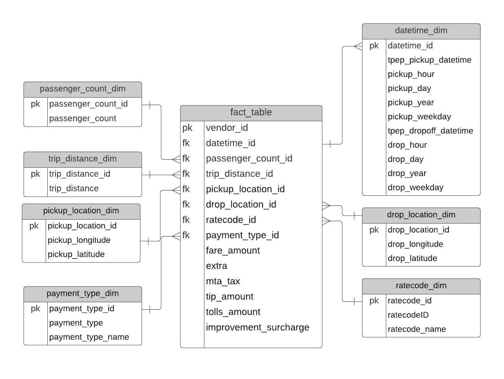
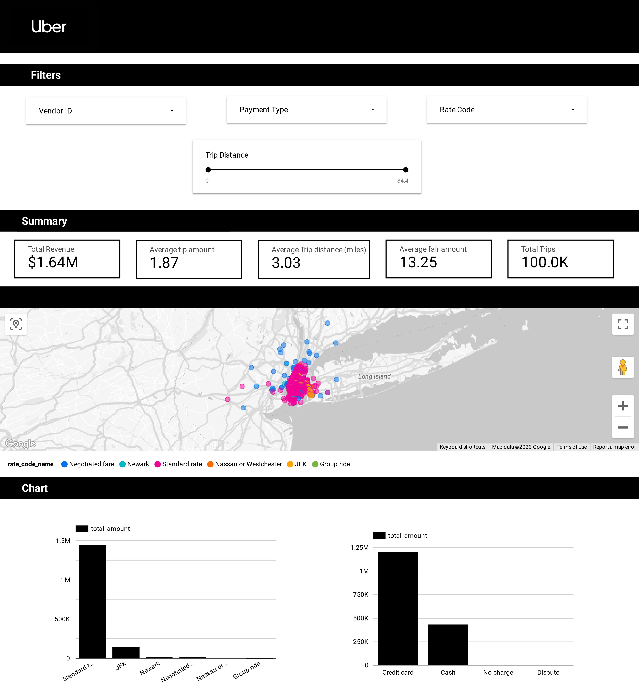

# Uber Data Analytics | Modern Data Engineering GCP Project

## Introduction

The goal of this project is to perform data analytics on Uber data using various tools and technologies, including GCP Storage, Python, Compute Instance, Mage Data Pipeline Tool, BigQuery, and Looker Studio.

Link to Live DashBoard->>https://lookerstudio.google.com/s/oJxoIAcwydY

## Architecture 

## Technology Used
- Programming Language - Python

Google Cloud Platform
1. Google Storage
2. Compute Instance 
3. BigQuery
4. Looker Studio

Modern Data Pipeine Tool - https://www.mage.ai/

Contibute to this open source project - https://github.com/mage-ai/mage-ai

## Dataset Used
TLC Trip Record Data
Yellow and green taxi trip records include fields capturing pick-up and drop-off dates/times, pick-up and drop-off locations, trip distances, itemized fares, rate types, payment types, and driver-reported passenger counts. 

Here is the dataset used in the video - https://github.com/darshilparmar/uber-etl-pipeline-data-engineering-project/blob/main/data/uber_data.csv

More info about dataset can be found here:
1. Website - https://www.nyc.gov/site/tlc/about/tlc-trip-record-data.page
2. Data Dictionary - https://www.nyc.gov/assets/tlc/downloads/pdf/data_dictionary_trip_records_yellow.pdf

## Data Model

## Pipeline 

## Insights 
Some insights generated were 
* Standard rate code generates the highest revenue indicating its popularity among users. 
* On average, trips to Newark result in the highest tip at $11. 
* Credit cards are the preferred mode of payment accounting for a significant 75% of all transactions, followed by cash.
* One-person trips make up the majority, comprising 66% of all recorded journeys.
* The bustling area around Jackson Ave, near the Queens Plaza station in Long Island City stands out as the top pickup location.
* The highest fare occurs at 2pm suggesting a peak period of travel. In contrast, the lowest fare is observed at 7am, likely due to off-peak hours.

## Dashboard

